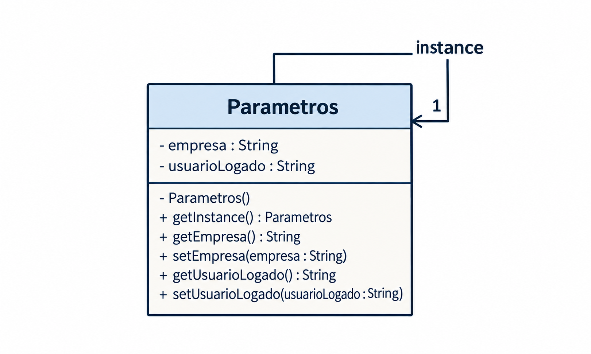

# Padrão de Projeto: Singleton (Sistema de RH)

Projeto em Java exemplificando a aplicação do padrão criacional **Singleton** no contexto de Recursos Humanos para a disciplina DCC078-2026.3-A - Aspectos Avançados em Engenharia de Software.

## Diagrama de Classes UML

## Estrutura

- `Parametros`: Classe Singleton responsável por armazenar parâmetros compartilhados do sistema, como empresa e usuário logado.
- `ParametrosTest`: Classe de teste para validar o acesso à instância única e os parâmetros armazenados.